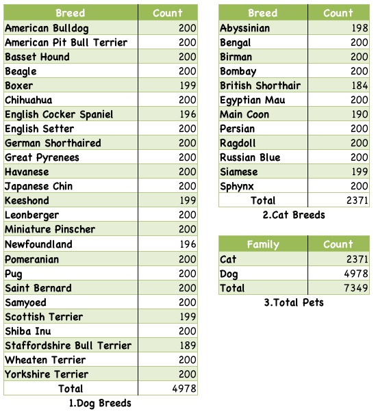

# Representações Aprendidas por Redes Neurais
Primeiro trabalho da disciplina de Visão Computacional, ministrada pelo Prof. Dr. Cesar H. Comin

Alunos:
- Vitor Lopes Fabris ([tremefabris](https://github.com/tremefabris))
- Jayme Sakae dos Reis Furuyama ([jaymesakae](https://github.com/jaymesakae))
- Vinicius Gonçalves Perillo ([ViniciusPerillo](https://github.com/ViniciusPerillo))

## Como funciona

Para o melhor fluxo dos treinamentos e validações das metodologias descritas no artigo, é recomendado seguir os seguintes passos para extração de features e fazer os treinamentos. Além disso, este repositório não contém o dataset, e portanto é necessário baixá-lo e extraí-lo em uma pasta, criada por você mesmo e dentro desse repositório, chamada `data/`.


### Extração de features
Para extrair as features do Oxford-IIIT Pets com a ResNet-18, rode:

```bash
python3 feature_extraction.py
```

### KNN: treinamento e avaliação
Para executar o treinamento e avaliação do algoritmo KNN, rode:

```bash
python3 knn.py
```

### K-Means: melhor número de clusters
Para calcular o melhor valor de clusters para ser executado no K-Means, rode:

```bash
python3 calculate_best_k.py
```
Esse _script_ vai rodar o K-Means um total de 3600 vezes (100 vezes para valores de K entre 2 e 38) para poder calcular o melhor valor possível. Por isso, ele é um tanto demorado. Por facilidade, incluímos junto do repositório, em `data/extracted-features/clustering_scores.csv`, os resultados desse processamento quando realizado por nós.

### K-Means: treinamento e avaliação
Para executar o treinamento e avaliação do algoritmo K-Means, rode:

```bash
python3 kmeans.py
```

## Informações do Dataset

Fonte: [https://www.robots.ox.ac.uk/~vgg/data/pets/](https://www.robots.ox.ac.uk/~vgg/data/pets/)

